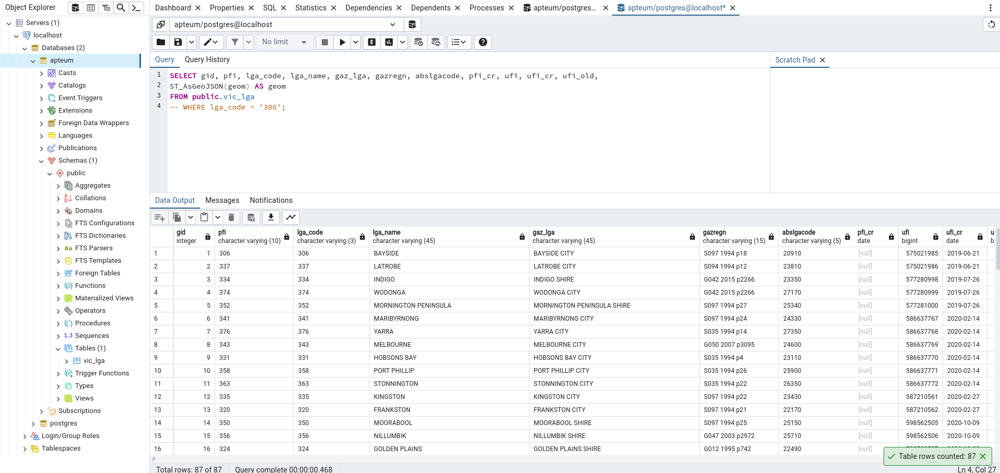
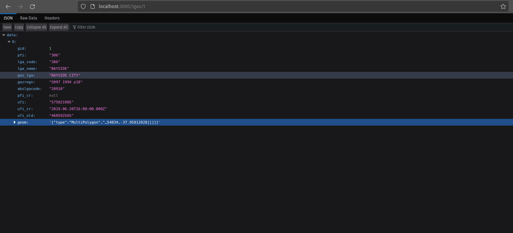
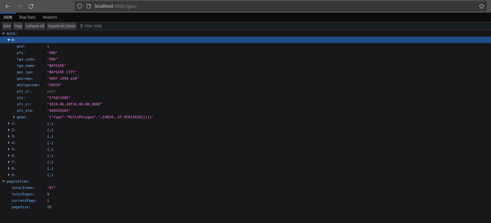
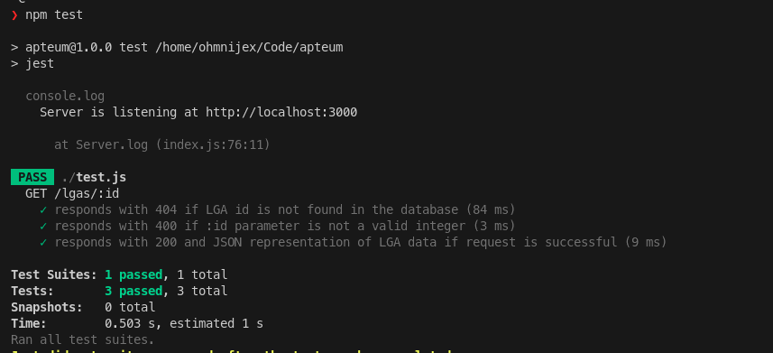

# Apteum Code Exam
## 1. The data had to be loaded in a PostgreSQL Database with the PostGIS extension

## 2. The API has a single endpoint (lgas/:id?) that has an optional id integer parameter that will return a single LGA data.

## 3. Otherwise, it will return paginated data with default parameter values of page=1, limit=10. Specific pages and limits can be specified in the URL (e.g. lgas/?page=2&limit=20)

## 4. Tests were also created for the specified constraints.
